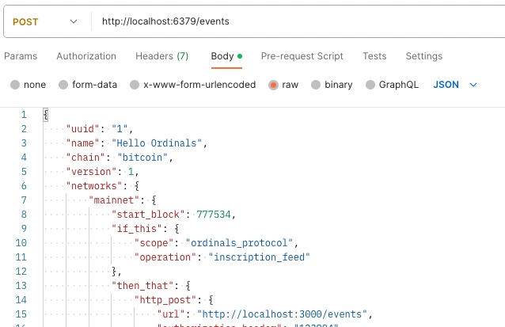

You can run Chainhook as a service to evaluate Bitcoin against your predicates. You can also dynamically register new predicates by enabling predicates registration API.

## Prerequisites

### Setting up a Bitcoin Node

- Install bitcoind using [this](https://bitcoin.org/en/bitcoin-core/) link. Ingesting blocks using bitcoind happens through zeromq, an embedded networking library in the bitcoind installation package.

Bitcoind installation will download binaries in a zip format, `bitcoin-22.0-osx64.tar.gz`. You can extract the zip file to view the folders. Expand the `bin` folder to see the bitcoind executable files.

- Navigate to your project folder, create a new file, and rename it to `bitcoin.conf` on your local machine. Copy the below configuration to the `bitcoin.conf` file.
- Get the downloaded path of the bitcoind from the [prerequisites section](#prerequisites) and use it in the `datadir` configuration below.
- Set a username of your choice for bitcoind and use it in the `rpcuser` configuration below.
- Set a password of your choice for bitcoind and use it in the `rpcpassword` configuration below.

>[!NOTE]
> Make a note of the `rpcuser`, `rpcpassword` and `rpcport` values to use them later in the chainhook configuration.

```conf
datadir=<path-to-your-downloaded-bitcoind>
server=1
rpcuser="bitcoind_username"  # You can set the username here
rpcpassword="bitcoind_password"  #  You can set the password here
rpcport=8332   # You can set your localhost port number here
rpcallowip=0.0.0.0/0
rpcallowip=::/0
txindex=1
listen=1
discover=0
dns=0
dnsseed=0
listenonion=0
rpcserialversion=1
disablewallet=0
fallbackfee=0.00001
rpcthreads=8
blocksonly=1
dbcache=4096

# Start zeromq
zmqpubhashblock=tcp://0.0.0.0:18543
```

Now that you have `bitcoin.conf` file ready with the bitcoind configurations, you can run the bitcoind node.
In the command below, use the path to your `bitcoin.conf` file from your machine and run the command in the terminal.

> [!NOTE]
> The below command is a startup process that might take a few hours to run.

`$ ./bitcoind -conf=<path-to-bitcoin.config>/bitcoin.conf`

Once the above command runs, you will see `zmq_url` entries in the output, enabling zeromq.

### Configure Chainhook

In this section, you will configure chainhook to match the network configurations with the bitcoin config file. First, [install the latest version of chainhook](../getting-started.md#install-chainhook-from-source).

Next, you will generate a `Chainhook.toml` file to connect Chainhook with your bitcoind node. Navigate to the directory where you want to generate the `Chainhook.toml` file and use the following command in your terminal:

`$ chainhook config generate --testnet`

The following `Chainhook.toml` file should be generated:

```toml
[storage]
working_dir = "cache"

# The Http Api allows you to register/deregister
# dynamically predicates.
# Disable by default.
#
[http_api]
http_port = 20456
database_uri = "redis://localhost:6379/"

[network]
mode = "testnet"
bitcoind_rpc_url = "http://localhost:8332" # Must match the rpcport in the bitcoin.conf
bitcoind_rpc_username = "<bitcoind_username>" # Must match the rpcuser in the bitcoin.conf
bitcoind_rpc_password = "<bitcoind_password>" # Must match the rpcpassword in the bitcoin.conf
stacks_node_rpc_url = "http://localhost:20443"

[limits]
max_number_of_bitcoin_predicates = 100
max_number_of_concurrent_bitcoin_scans = 100
max_number_of_stacks_predicates = 10
max_number_of_concurrent_stacks_scans = 10
max_number_of_processing_threads = 16
max_number_of_networking_threads = 16
max_caching_memory_size_mb = 32000

[[event_source]]
tsv_file_url = "https://archive.hiro.so/mainnet/stacks-blockchain-api/mainnet-stacks-blockchain-api-latest"

```

In the `Chainhook.toml` file that gets generated, you'll need to match the network parameters to the `bitcoin.config` that was generated earlier in [this](#prepare-the-bitcoind-node) section to allow Chainhook to connect to the bitcoin layer.

The Bitcoin node is exposing the rpc endpoints. To protect the endpoints, we are using rpc username and password fields. To run Chainhook as a service using Bitcoin, you must match the rpc endpoints username, password, and network ports.

As such, some configurations will need to match between Chainhook and the bitcoind node. In the `Chainhook.toml`, update the following network parameters to match the `bitcoin.conf`:

| bitcoin.conf      | Chainhook.toml                |
| -----------       | -----------                   |
| rpcuser           | bitcoind_rpc_username         |
| rpcpassword       | bitcoind_rpc_password         |
| rpcport           | bitcoind_rpc_url              |
| zmqpubhashblock   | bitcoind_zmq_url              |

In the `Chainhook.toml` file,

- Update the `bitcoind_rpc_username` to use the username set for `rpcuser` earlier.
- Update the `bitcoind_rpc_password` to use the password set for  `rpcpassword` earlier.
- Update the `bitcoind_rpc_url` to use the same host and port for the `rpcport` earlier.
- Next, update the `bitcoind_zmq_url` to use the same host and port for the `zmqpubhashblock` that was set earlier.

## Scan blockchain based on predicates

Now that your bitcoind and Chainhook configurations are done, you can scan your blocks by defining your [predicates](../overview.md#if-this-predicate-design). This section helps you with an example JSON file to scan a range of blocks in the blockchain and render the results. To understand the supported predicates for Bitcoin, refer to [how to use chainhook with bitcoin](how-to-use-chainhook-with-bitcoin.md).

The following are the two examples to walk you through `file_append` and `http_post` `then-that` predicate designs.

Example 1 uses the `ordinals.json` file to scan the predicates and render results using `file_append`.
Example 2 uses the `ordinals_protocol.json` to scan the predicates and render results using `http_post`.

You can choose between the following examples to scan the predicates.

### Example 1

Run the following command in your terminal to generate a sample JSON file with predicates.

`$ chainhook predicates new ordinals.json --bitcoin`

A JSON file `ordinals.json` is generated.

```json
{
    "uuid": "1",
    "name": "Hello Ordinals",
    "chain": "bitcoin",
    "version": 1,
    "networks": {
        "testnet": {
            "start_block": 777534,
            "end_block": 777540,
            "if_this": {
                "scope": "ordinals_protocol",
                "operation": "inscription_feed"
            },
            "then_that": {
                "file_append": {
                    "path": "inscription_feed.txt"
                }
            }
        }

    }
}
```

> [!NOTE]
> You can get blockchain height and current block by referring to https://explorer.hiro.so/blocks?chain=mainnet

Now, use the following command to scan the blocks based on the predicates defined in the `ordinals.json` file.

`$ chainhook predicates scan ordinals.json --config-path=./Chainhook.toml`

The output of the above command will be a text file `inscription_feed.txt` generated based on the predicate definition.

> [!TIP]
> To optimize your experience with scanning, the following are a few knobs you can play with:
> - Use of adequate values for `start_block` and `end_block` in predicates will drastically improve the performance.
> - Reducing the number of network hops between the Chainhook and the bitcoind processes can also help, so your network setup can play a major role in performance.

### Example 2

Run the following command in your terminal to generate a sample JSON file with predicates.

`$ chainhook predicates new ordinals_protocol.json --bitcoin`

A JSON file `ordinals_protocol.json` is generated. You can now edit the JSON based on the available predicates for Bitcoin. To understand the available predicates, refer to [how to use chainhook with bitcoin](how-to-use-chainhook-with-bitcoin.md).

```json
{
    "uuid": "1",
    "name": "Hello Ordinals",
    "chain": "bitcoin",
    "version": 1,
    "networks": {
        "testnet": {
            "if_this": {
                "scope": "ordinals_protocol",
                "operation": "inscription_feed"
            },
            "then_that": {
                "http_post": {
                    "url": "http://localhost:3000/events",
                    "authorization_header": "123904"
                }
            },
            "start_block": 777534,
        }

    }
}
```

> [!Note]
> The `start_block` is the required field to use the `http_post` `then-that` predicate.

Now, use the following command to scan the blocks based on the predicates defined in the `ordinals_protocol.json` file.

`$ chainhook predicates scan ordinals_protocol.json --config-path=./Chainhook.toml`

The above command posts events to the URL, `http://localhost:3000/events` mentioned in the JSON file.

## Initiate Chainhook Service

In this section, you'll learn how to initiate the chainhook service using the following two ways and use the REST API call to post the events onto a server.

- Initiate the chainhook service by passing the predicate path to the command as shown below.

  `$ chainhook service start --predicate-path=ordinals_protocol.json --config-path=Chainhook.toml`

  The above command registers the predicates based on the predicate definition in the `ordinals_protocol.json` file.
  
- You can start the chainhook service and pass the predicates dynamically to post the events based on the `then-that` predicate definition. To do this, first:
  - Uncomment the following lines of code in the `Chainhook.toml` file to enable the predicate registration server.
	  ```
    [http_api]
    http_port = 20456
    database_uri = "redis://localhost:6379/"
    ```
  - Pass the JSON file as input in the body of the HTTP API call as shown in the screenshot below.
  

Then, start the chainhook service using the following command:
`$ chainhook service start --config-path=Chainhook.toml`

The above command posts the events to the `http://localhost:3000/api/v1/vaults` as mentioned in the predicate definition.

The sample payload response should look like:

```jsonc
{
    "chainhook": {
        "predicate": {
            "operation": "inscription_feed",
            "scope": "ordinals_protocol"
        },
        "uuid": "1"
    },
    "apply": [{
        "block_identifier": {
            "hash": "0x00000000000000000003e3e2ffd3baaff2cddda7d12e84ed0ffe6f7778e988d4",
            "index": 777534
        },
        "metadata": {},
        "parent_block_identifier": {
            "hash": "0x0000000000000000000463a1034c59e6dc94c7e52855582af11882743b86e2a7",
            "index": 777533
        },
        "timestamp": 1676923039,
        "transactions": [{
            "transaction_identifier": {
                "hash": "0xca20efe5e4d71c16cd9b8dfe4d969efdd225ef0a26136a6a4409cb3afb2e013e"
            },
            "metadata": {
                "ordinal_operations": [{
                    "inscription_revealed": {
                        "content_bytes": "<INSCRIPTION_BYTES>",
                        "content_length": 12293,
                        "content_type": "image/jpeg",
                        "inscriber_address": "bc1punnjva5ayg84kf5tmvx265uwvp8py3ux24skz43aycj5rzdgzjfq0jxsuc",
                        "inscription_fee": 64520,
                        "inscription_id": "ca20efe5e4d71c16cd9b8dfe4d969efdd225ef0a26136a6a4409cb3afb2e013ei0",
                        "inscription_number": 0,
                        "inscription_output_value": 10000,
                        "ordinal_block_height": 543164,
                        "ordinal_number": 1728956147664701,
                        "ordinal_offset": 1147664701,
                        "satpoint_post_inscription": "ca20efe5e4d71c16cd9b8dfe4d969efdd225ef0a26136a6a4409cb3afb2e013e:0:0",
                        "transfers_pre_inscription": 0
                    }
                }],
                "proof": null
            },
            "operations": []
            // Other transactions
        }]
    }],
    "rollback": [],
}
```

Understand the output of the above JSON file with the following details.

- The `apply` payload includes the block header and the transactions that triggered the predicate.

- The `rollback` payload includes the block header and the transactions that triggered the predicate for a past block that is no longer part of the canonical chain and must be reverted.

> [!TIP]
> You can define multiple predicates and pass them as arguments to start the chainhook service. 
> Example:  `$ chainhook service start --predicate-path=predicate_1.json --predicate-path=predicate_2.json --config-path=Chainhook.toml`

## References

- To learn more about Ordinals, refer to [Introducing Ordinals Explorer and Ordinals API](https://www.hiro.so/blog/introducing-the-ordinals-explorer-and-ordinals-api)
- The [OpenAPI specification for chainhook](https://raw.githubusercontent.com/hirosystems/chainhook/develop/docs/chainhook-openapi.json) is available to understand the scope of chainhook.
