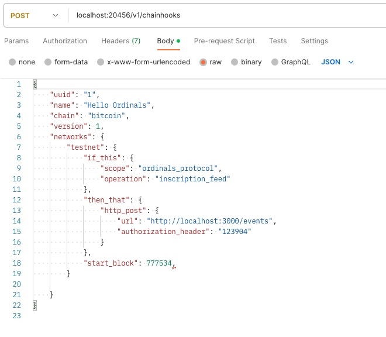

You can run Chainhook as a service to evaluate Stacks blocks against your predicates. You can also dynamically register new predicates by enabling predicates registration API.

Start with the prerequisite section and configure your files to start the chainhook service.

## Prerequisite

### Configure Stacks Node

- Configure your stacks node using the [Stacks node configuration](https://docs.stacks.co/docs/nodes-and-miners/stacks-node-configuration) documentation.
- Recommend the latest version of Stacks. You can check the latest version by following [this](https://github.com/stacks-network/stacks-blockchain/releases) link.
- Set up the bitcoin node by following [this](how-to-run-chainhook-as-a-service-using-bitcoind.md#setting-up-a-bitcoin-node) article, then get the `rpcuser`, `rpcpassword`, and `rpc_port` values defined in the `bitcoin.conf` file.

A `Stacks.toml` file is generated when configuring the stacks node. Below is the sample `Stacks.toml` file.

```toml
[node]
working_dir = "/stacks-blockchain"
rpc_bind = "0.0.0.0:20443"          # Make a note of this port to use in the `Chainhook.toml`
p2p_bind = "0.0.0.0:20444"
bootstrap_node = "02da7a464ac770ae8337a343670778b93410f2f3fef6bea98dd1c3e9224459d36b@seed-0.mainnet.stacks.co:20444,02afeae522aab5f8c99a00ddf75fbcb4a641e052dd48836408d9cf437344b63516@seed-1.mainnet.stacks.co:20444,03652212ea76be0ed4cd83a25c06e57819993029a7b9999f7d63c36340b34a4e62@seed-2.mainnet.stacks.co:20444"

[burnchain]
chain = "bitcoin"
mode = "mainnet"
peer_host = "localhost"
username = "bitcoind_username"       # Must match the rpcuser in the bitcoin.conf
password = "bitcoind_password"       # Must match the rpcpassword in the bitcoin.conf
rpc_port = 8332                      # Must match the rpcport in the bitcoin.conf
peer_port = 8333

[[events_observer]]
endpoint = "localhost:20455"
retry_count = 255
events_keys = ["*"]

```

> [!NOTE]
> Ensure that the `username`, `password`, and `rpc_port` values in the `Stacks.toml` file match the values in the `bitcoin.conf` file. Also, note the `rpc_bind` port to use in the `Chainhook.toml` configuration in the next section of this article.

### Configure Chainhook

In this section, you will configure a chainhook to communicate with the network. Run the following command in your terminal and generate the `Chainhook.toml` file.

`$ chainhook config generate --testnet`

Ensure that the `bitcoind_rpc_url`, `bitcoind_rpc_username`, `bitcoind_rpc_password` match with the `rpcport`, `rpcuser` and `rpcpassword` in the `bitcoin.conf` file and the port of the `stacks_node_rpc_url` matches the `rpc_bind` in the `Stacks.toml` file.

The following `Chainhook.toml` file is generated:

```toml
[storage]
working_dir = "cache"

# The HTTP API allows you to register/deregister
# dynamically predicates
# Disable by default
#
# [http_api]
# http_port = 20456
# database_uri = "redis://localhost:6379/"

[network]
mode = "mainnet"
bitcoind_rpc_url = "http://localhost:8332"                # Must match with the rpcport in the bitcoin.conf
bitcoind_rpc_username = "<bitcoind_username>"             # Must match with the rpcuser in the bitcoin.conf
bitcoind_rpc_password = "<bitcoind_password>"             # Must match with the rpcpassword in the bitcoin.conf
stacks_node_rpc_url = "http://localhost:20443"            # Must match with the rpc_bind in the Stacks.toml file

[limits]
max_number_of_bitcoin_predicates = 100
max_number_of_concurrent_bitcoin_scans = 100
max_number_of_stacks_predicates = 10
max_number_of_concurrent_stacks_scans = 10
max_number_of_processing_threads = 16
max_number_of_networking_threads = 16
max_caching_memory_size_mb = 32000

[[event_source]]
tsv_file_url = "https://archive.hiro.so/mainnet/stacks-blockchain-api/mainnet-stacks-blockchain-api-latest"

```

Ensure the following configurations are matched to allow chainhook to communicate with the Stacks and Bitcoin layers.

| bitcoin.conf      | Stacks.toml            | Chainhook.toml               |
| -----------       | -----------            |  -------------               |
| rpcuser           | username               | bitcoind_rpc_username        |
| rpcpassword       | password               | bitcoind_rpc_password        |
| rpcport           | rpc_port               | bitcoind_rpc_url             |
| zmqpubhashblock   |                        | bitcoind_zmq_url             |
|                   | rpc_bind               | stacks_node_rpc_url          |
|                   | endpoint               | stacks_events_ingestion_port |

> [!NOTE]
> The `bitcoind_zmq_url` is optional when running chainhook as a service using stacks because stacks will pull the blocks from Stacks and the Bitcoin chain.

## Scan blockchain based on predicates

Now that the stacks and chainhook configurations are done, you can scan your blocks by defining your [predicates](../overview.md#if-this-predicate-design). This section helps you with sample JSON files to scan the blocks in the blockchain and render the results. To understand the supported predicates for Stacks, refer to [how to use chainhook with stacks](how-to-use-chainhook-with-stacks.md).

The following are the two examples to walk you through `file_append` and `http_post` `then-that` predicate designs.

Example 1 uses a `print_event.json` file to scan the predicates and render results using `file_append`.
Example 2 uses `print_event.json` to scan the predicates and render results using `http_post`.

You can choose between the following examples to scan the predicates.

### Example 1

Run the following command to generate a sample JSON file with predicates in your terminal.

`$ chainhook predicates new print_event_1.json --stacks`

A JSON file `print_event_1.json` is generated.

```json
{
  "chain": "stacks",
  "uuid": "1da35032-e399-430c-bfbc-eca94709ad11",
  "name": "Hello world",
  "version": 1,
  "networks": {
    "testnet": {
      "start_block": 0,
      "end_block": 100,
      "if_this": {
        "scope": "print_event_1",
        "contract_identifier": "ST1SVA0SST0EDT4MFYGWGP6GNSXMMQJDVP1G8QTTC.arkadiko-freddie-v1-1",
        "contains": "vault"
      },
      "then_that": {
        "file_append": {
          "path": "arkadiko.txt"
        }
      }
    },
    "mainnet": {
      "start_block": 0,
      "end_block": 100,
      "if_this": {
        "scope": "print_event_1",
        "contract_identifier": "SP2C2YFP12AJZB4MABJBAJ55XECVS7E4PMMZ89YZR.arkadiko-freddie-v1-1",
        "contains": "vault"
      },
      "then_that": {
        "file_append": {
          "path": "arkadiko.txt"
        }
      }
    }
  }
}
```

> [!NOTE]
> You can get blockchain height and current block in the [Explorer](https://explorer.hiro.so/blocks?chain=mainnet).

The sample `arkadiko.txt` should look like this:

```
{"apply":[{"block_identifier":{"hash":"0xf048102fee15dda049e6781c8e9aec1b39b1b9dc68d06fd9b84dced1b80ddd62","index":34307},"metadata":{"bitcoin_anchor_block_identifier":{"hash":"0x000000000000000000098e9ebc30e7c8e32b30ffecbd7dc5c715b5f07e1de25c","index":705648},"confirm_microblock_identifier":{"hash":"0xa65642590e98f54183a0be747a1c01e41d3ba211f6599eff2574d78ed2578468","index":2},"pox_cycle_index":18,"pox_cycle_length":2100,"pox_cycle_position":1797,"stacks_block_hash":"0x77a1aed86e895cb4b7b969986aa6a28eb2465e7227f351dd4e23d28448b222e9"},"parent_block_identifier":{"hash":"0x3117663ee5c5690d76e3f6c97597cbcc95085e7cecb0791d3edc4f95a4ce6f23","index":34306},"timestamp":1634625398,"transactions":[{"metadata":{"description":"invoked: SP2C2YFP12AJZB4MABJBAJ55XECVS7E4PMMZ89YZR.arkadiko-freddie-v1-1::collateralize-and-mint(u300000000, u130000000, (tuple (auto-payoff true) (stack-pox true)), \"STX-A\", SP2C2YFP12AJZB4MABJBAJ55XECVS7E4PMMZ89YZR.arkadiko-stx-reserve-v1-1, SP2C2YFP12AJZB4MABJBAJ55XECVS7E4PMMZ89YZR.arkadiko-token, SP2C2YFP12AJZB4MABJBAJ55XECVS7E4PMMZ89YZR.arkadiko-collateral-types-v1-1, SP2C2YFP12AJZB4MABJBAJ55XECVS7E4PMMZ89YZR.arkadiko-oracle-v1-1)","execution_cost":{"read_count":155,"read_length":318312,"runtime":349859000,"write_count":10,"write_length":3621},"fee":188800,"kind":{"data":{"args":["u300000000","u130000000","(tuple (auto-payoff true) (stack-pox true))","\"STX-A\"","SP2C2YFP12AJZB4MABJBAJ55XECVS7E4PMMZ89YZR.arkadiko-stx-reserve-v1-1","SP2C2YFP12AJZB4MABJBAJ55XECVS7E4PMMZ89YZR.arkadiko-token","SP2C2YFP12AJZB4MABJBAJ55XECVS7E4PMMZ89YZR.arkadiko-collateral-types-v1-1","SP2C2YFP12AJZB4MABJBAJ55XECVS7E4PMMZ89YZR.arkadiko-oracle-v1-1"],"contract_identifier":"SP2C2YFP12AJZB4MABJBAJ55XECVS7E4PMMZ89YZR.arkadiko-freddie-v1-1","method":"collateralize-and-mint"},"type":"ContractCall"},"nonce":15,"position":{"index":16},"proof":null,...
```

Now, use the following command to scan the blocks based on the predicates defined in the `print_event_1.json` file.

`$ chainhook predicates scan print_event_1.json --testnet`

The output of the above command will be a text file `arkadiko.txt` generated based on the predicate definition.

> [!TIP]
> To optimize your experience with scanning, the following are a few knobs you can play with:
> Use of adequate values for `start_block` and `end_block` in predicates will drastically improve the performance.
> Networking: reducing the number of network hops between the chainhook and the bitcoind processes can also help.

The sample output file, `arkadiko.txt,` looks like this:

```text
{"apply":[{"block_identifier":{"hash":"0xf048102fee15dda049e6781c8e9aec1b39b1b9dc68d06fd9b84dced1b80ddd62","index":34307},"metadata":{"bitcoin_anchor_block_identifier":{"hash":"0x000000000000000000098e9ebc30e7c8e32b30ffecbd7dc5c715b5f07e1de25c","index":705648},"confirm_microblock_identifier":{"hash":"0xa65642590e98f54183a0be747a1c01e41d3ba211f6599eff2574d78ed2578468","index":2},"pox_cycle_index":18,"pox_cycle_length":2100,"pox_cycle_position":1797,"stacks_block_hash":"0x77a1aed86e895cb4b7b969986aa6a28eb2465e7227f351dd4e23d28448b222e9"},"parent_block_identifier":{"hash":"0x3117663ee5c5690d76e3f6c97597cbcc95085e7cecb0791d3edc4f95a4ce6f23","index":34306},"timestamp":1634625398,"transactions":[{"metadata":{"description":"invoked: SP2C2YFP12AJZB4MABJBAJ55XECVS7E4PMMZ89YZR.arkadiko-freddie-v1-1::collateralize-and-mint(u300000000, u130000000, (tuple (auto-payoff true) (stack-pox true)), \"STX-A\", SP2C2YFP12AJZB4MABJBAJ55XECVS7E4PMMZ89YZR.arkadiko-stx-reserve-v1-1, SP2C2YFP12AJZB4MABJBAJ55XECVS7E4PMMZ89YZR.arkadiko-token, SP2C2YFP12AJZB4MABJBAJ55XECVS7E4PMMZ89YZR.arkadiko-collateral-types-v1-1, SP2C2YFP12AJZB4MABJBAJ55XECVS7E4PMMZ89YZR.arkadiko-oracle-v1-1)","execution_cost":{"read_count":155,"read_length":318312,"runtime":349859000,"write_count":10,"write_length":3621},"fee":188800,"kind":{"data":{"args":["u300000000","u130000000","(tuple (auto-payoff true) (stack-pox true))","\"STX-A\"",.........
```

### Example 2

Run the following command to generate a sample JSON file with predicates in your terminal.

`$ chainhook predicates new print_event_2.json --stacks`

A JSON file `print_event_2.json` is generated.

```json
{
  "chain": "stacks",
  "uuid": "1",
  "name": "Lorem ipsum",
  "version": 1,
  "networks": {
    "testnet": {
        "if_this": {
            "scope": "print_event_2",
            "contract_identifier": "ST1PQHQKV0RJXZFY1DGX8MNSNYVE3VGZJSRTPGZGM.monkey-sip09",
            "contains": "vault"
        },
        "then_that": {
            "http_post": {
            "url": "http://localhost:3000/api/v1/vaults",
            "authorization_header": "Bearer cn389ncoiwuencr"
            }
        },
        "start_block": 10200,
        "expire_after_occurrence": 5,
    }
  }
}
```

> [!Note]
> The `start_block` is the required field to use the `http_post` `then-that` predicate.

Now, use the following command to scan the blocks based on the predicates defined in the `print_event_2.json` file.

`$ chainhook predicates scan print_event_2.json --testnet`

The above command posts events to the URL `http://localhost:3000/api/v1/vaults` mentioned in the `Chainhook.toml` file.

## Initiate Chainhook Service

In this section, you'll learn how to initiate the chainhook service using the following two ways and use the REST API call to post the events onto a server.

- Initiate the chainhook service by passing the predicate path to the command as shown below.

  `$ chainhook service start --predicate-path=print_event_1.json --config-path=Chainhook.toml`

  The above command registers the predicates based on the predicate definition in the `print_event_1.json` file.
  
- You can also dynamically register predicates via the predicate registration server. To do this:
  - Uncomment the following lines of code in the `Chainhook.toml` file to enable the predicate registration server.
    ```
    [http_api]
    http_port = 20456
    database_uri = "redis://localhost:6379/"
    ```
  - Start the Chainhook service by running `$ chainhook service start --config-path=Chainhook.toml`.
  - Now, the predicate registration server is running at `localhost:20456`. To dynamically register a new predicate, send a POST request to `localhost:20456/v1/chainhooks` with the new predicate, in JSON format, included in the request body. For complete documentation on the API endpoints available, see the [OpenAPI](https://raw.githubusercontent.com/hirosystems/chainhook/develop/docs/chainhook-openapi.json) specification.
  - 

> [!TIP]
> You can also run chainhook service by passing multiple predicates.
> Example:  `$ chainhook service start --predicate-path=predicate_1.json --predicate-path=predicate_2.json --config-path=Chainhook.toml`
